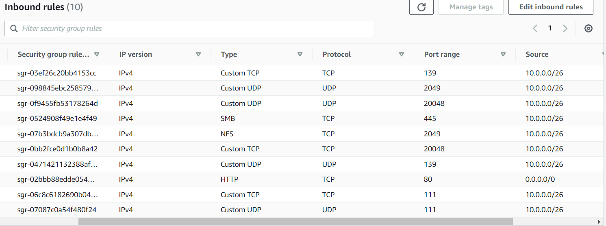

### storage gatway configuration

1. AWS Storage Gateway
======================
  On-premises access to virtually unlimited cloud storage.
   -> Seamlessly and securely integrate your on-premises IT environment with AWS storage infrastructure.

* create starage gateway console
  
   1. file gateway: file gateway nothing but evevy 15 minutes replicate data forn server to s3 bucket.
      
      * With a S3 File Gateway, you can do the following:

        You can store and retrieve files directly using the NFS version 3 or 4.1 protocol.

        You can store and retrieve files directly using the SMB file system version, 2 and 3 protocol.

        You can access your data directly in Amazon S3 from any AWS Cloud application or service.

        You can manage your S3 data using lifecycle policies, cross-region replication, and versioning. You can think of a S3 File Gateway as a file system mount on Amazon S3.

   2. volume gateway: is nothing but after taking the snapshot from ec2 i mean ebs volume if you want to put into s3    bucket we can use this volume gatewy.
      
      AWS Storage Gateway connects an on-premises software appliance with cloud-based storage to provide seamless integration with data security features between your on-premises IT environment and the AWS storage infrastructure. You can use the service to store data in the Amazon Web Services Cloud for scalable and cost-effective storage that helps maintain data security.

        AWS Storage Gateway offers file-based File Gateways (Amazon S3 File and Amazon FSx File), volume-based (Cached and Stored), and tape-based storage solutions.

   3. tape gatway: if ypu do have tape server on premise and yoou can can able to migrate.
      
        AWS Storage Gateway connects an on-premises software appliance with cloud-based storage to provide seamless integration with data security features between your on-premises IT environment and the AWS storage infrastructure. You can use the service to store data in the Amazon Web Services Cloud for scalable and cost-effective storage that helps maintain data security.

        AWS Storage Gateway offers file-based File Gateways (Amazon S3 File and Amazon FSx File), volume-based (Cached and Stored), and tape-based storage solutions.

   4. Amazon FSx File Gateway: (FSx File Gateway) is a new File Gateway type that provides low latency and efficient access to in-cloud FSx for Windows File Server file shares from your on-premises facility. If you maintain on-premises file storage because of latency or bandwidth requirements, you can instead use FSx File Gateway for seamless access to fully managed, highly reliable, and virtually unlimited Windows file shares provided in the AWS Cloud by FSx for Windows File Server.

        * Benefits of using Amazon FSx File Gateway
        -----------------------------------------
        FSx File Gateway provides the following benefits:

        Helps eliminate on-premises file servers and consolidates all their data in AWS to take advantage of the scale and economics of cloud storage.

        Provides options that you can use for all your file workloads, including those that require on-premises access to cloud data.

        Applications that need to stay on premises can now experience the same low latency and high performance that they have in AWS, without taxing your networks or impacting the latencies experienced by your most demanding applications.

   5. following steps need to do.

      1. create s3 bucket

      2. create IAM role with starage gateway full access and S3 list
        
         click on create-role button

           console: [select] AWS service

           Service or use case: [select] Storage Gateway

           click on next button

           Add permissions:
             Permissions policies:
               [select] AmazonS3FullAccess

            click on next button

             Role details:
               
               Role name: staragegateway

               Description: migrate data from app server to s3 bucket

               Add tags - optional
                 
                 key : name                 Value: storagegw
                
            click on create-role button

      3. go back storage gateway console
        
        * Step 1

        Gateway name: storage gateway

        Gateway time zone: Choose the local time zone based on where you are deploying your gateway.

        note: 
        [select] VMware ESXi
                 Microsoft Hyper-V
                 Linux KVM --> these three options we do have onprime application server migrate to aws cloud storage use based on requirement.
        [select] Amazon EC2 --we do have this option only.

        Launch EC2 instance:
          [select] Use default settings
             Virtual private cloud (VPC) network:IBM: PROD:FLPKRT:VPC:01

             VPC subnet: IBM:PROD:FLPKRT:SUBNET:01

             Key pair: winvms

             we'll get notification :Successfully launched the instance

             click on next: 
        * Step 2
          Connect to AWS

          Gateway connection options:
            Connection options: [select] IP address
            IP address: 18.170.60.213

        note: check sgw-sg rules
            

        * now need add storage gate way pem file to app3,app4

          will do this first

          windows to wondows - FTP
          windows to linux   - XFTP
          Linux to linux     - SCP
          Linux to windows   - SAMBA  -- these are the file transfor protocol 

        
        
