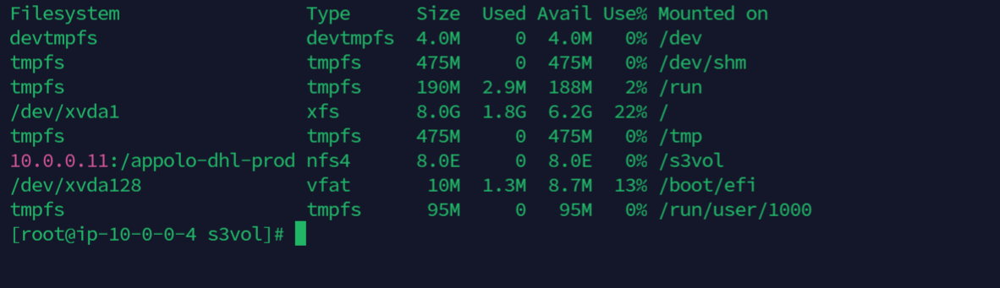

#### 03-add-file-share-s3-mount-point-to-ec2

  go to storage gate way console
   
  [1]  Storage Gateway:
      click on (share-0EB7D07C) file share id then bottom will get mount point details

   

      go to app3 
      
      -> cd /

      -> df -hT

      -> mount -t nfs -o nolock,hard 10.0.0.11:/appolo-dhl-prod /s3vol -- this command will resize the attached volume

      -> df -hT

   

  [2] go to app4 

      -> mount -t nfs -o nolock,hard 10.0.0.11:/appolo-dhl-prod /s3vol

      -> df -hT

   

   trableshooting:

      -> nslookup mount -t nfs -o nolock,hard 10.0.0.11:/appolo-dhl-prod
      
      -> ping (starage gateway private ip)
     
      -> open 2049 nfs

      -> top 

      -> ps -eaf | grep nfs

      -> service nfs start

      -> yum list installed | grep nfs-utils

      -> yum install nfs-utils

      -> yum install nfs-utils

      ->systemctl list-unit-files | grep nfs

        add storage gat way sg add protocol: SSH port: 22 allow any ip

   [note] - finally ec2 and s3 mounted    

