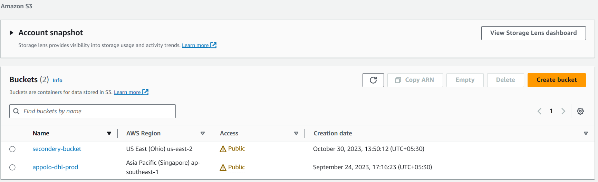

#### 04-primarys3-replicating-to-seconderys3

1. go to s3 console and click on s3 create-bucket

   * step1
     
     Create bucket:
       * General configuration:
         
         Bucket name: appolo-dhl-prod

         AWS Region: London

         Copy settings from existing bucket - optional: if already we do have bucket [select] choose bucket

       * Object Ownership:
         
         [select] ACLs enabled

         Object Ownership: [selecct] Bucket owner preferred

       * Block Public Access settings for this bucket
         
           [deselect] : Block all public access

           [select] I acknowledge that the current settings might result in this bucket and the objects within becoming public.

       * Bucket Versioning
           
          Bucket Versioning:

          [select] enable

       * Tags - optional

          Key: Name                    Value: appolo-dhl-prod

       * Default encryption

         Encryption type: [select] Server-side encryption with Amazon S3 managed keys (SSE-S3)

         Bucket Key: [select] Enable

         note: Using an S3 Bucket Key for SSE-KMS reduces encryption costs by lowering calls to AWS KMS. S3 Bucket Keys aren't supported for DSSE-KMS 

       * Advanced settings

         Object Lock: [select] Disable

        finally click on create-bucket Button
  
    view the s3 bucket which we have created

   
     
2. go to s3 console and click on create-bucket for secondary replication.

   * step2:

   Create bucket:
     
     * General configuration
       
         Bucket name: secondarys3-bucket

         AWS Region: Ohio

         Copy settings from existing bucket - optional: if already we do have bucket [select] choose bucket

     * Object Ownership

         [select] ACLs enabled

         Object Ownership: [select] Bucket owner preferred

     * Block Public Access settings for this bucket

         [deselect] Block all public access

         [select] I acknowledge that the current settings might result in this bucket and the objects within becoming public.

     * Bucket Versioning

         Bucket Versioning: [select] enable

     * Tags - optional
         
         Key: Name                               value: secondarys3-bucket

     * Default encryption
       
         Encryption type: [select] Server-side encryption with Amazon S3 managed keys (SSE-S3)

         Bucket Key: [select] enable

     * Advanced settings
       
       Object Lock: [select] desable

       click on create-bucket

    review this:
     
  view the s3 bucket which we have created

    

         

            
          

